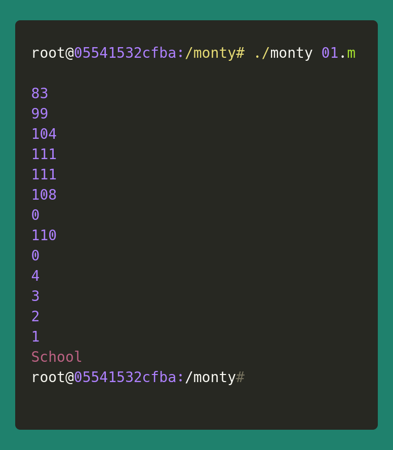

# Monty
## C - Stacks, Queues - LIFO, FIFO

### What is this project about?
A project for [Holberton School](https://www.holbertonschool.com/), the goal of this project is to create an interpreter for Monty ByteCodes files. [Monty](http://montyscoconut.github.io/) 0.98 is a scripting language that is first compiled into Monty byte codes (Just like Python). It relies on a unique stack, with specific instructions to manipulate it.

Monty byte code files

Files containing Monty byte codes usually have the .m extension. There is not more than one instruction per line. There can be any number of spaces before or after the opcode and its argument. Files can contain blank lines (empty or made of spaces only, and any additional text after the opcode or its required argument is not taken into account:

```
push 0$
push 1$
push 2$
  push 3$
                   pall    $
push 4$
    push 5    $
      push    6        $
pall$
```




### The monty program

- Compilation
The files are to be compiled this way:
```
$ gcc -Wall -Werror -Wextra -pedantic *.c -o monty
```

- Usage from command line interpreter: 
where file_name is the path to the file containing Monty byte code.

```
$ monty file_name
```

### Implemented opcodes

- **push**: pushes an element to the stack.

  Usage: `push <int>` where `<int>` is an integer

- **pall**: prints all the values on the stack, starting from the top of the stack.

  Usage: `pall`

- **pint**: prints the value at the top of the stack followed by a new line.

  Usage: `pint`

- **pop**: removes the top element of the stack.

  Usage: `pop`

- **swap**: swaps the top two elements of the stack.

  Usage: `swap`

- **add**: adds the top two elements of the stack. The answer is stored in the second top element of the stack and the top element is removed so that the top element contains the result and the stack is one element shorter.

  Usage: `add`

- **nop**: nothing.

  Usage: `nop`

- **sub**: subtracts the top element of the stack from the second element of the stack. The answer is stored in the second top element of the stack and the top element is removed so that the top element contains the result and the stack is one element shorter.

  Usage: `sub`

- **div**: divides the second top element of the stack by the first element of the stack. The answer is stored in the second top element of the stack and the top element is removed so that the top element contains the result and the stack is one element shorter.

  Usage: `div`

- **mul**: multiplies the top two elements of the stack. The answer is stored in the second top element of the stack and the top element is removed so that the top element contains the result and the stack is one element shorter.

  Usage: `mul`

- **mod**: computes the remainder of the division of the second top element of the stack by the top element of the stack. The answer is stored in the second top element of the stack and the top element is removed so that the top element contains the result and the stack is one element shorter.

  Usage: `mod`

- **pchar**: prints the character at the top of the stack if it is a printable character.

  Usage: `pchar`

- **pstr**: prints the string starting at the top of the stack.

  Usage: `pstr`

- **rotl**: rotates the stack to the left.

  Usage: `rotl`

- **rotr**: rotates the stack to the right.

  Usage: `rotr`

- **comments** When the first non-space character of a line is #, treat this line as a comment


## Authors
### **Diana Parra**
[dianaparr](https://github.com/dianaparr)
[twitter](https://twitter.com/dianaparra017)
[linkedIn](https://www.linkedin.com/in/dev-diana-parra/)

Diana is a natural sciences and environmental education graduate with a passion for programming logic, data science and backend development from Medellín-Colombia.

<br />

### **Louvani**
[Louvani](https://github.com/louvani)
[Portfolio](https://louuvani.com)
[twitter](https://twitter.com/PaulaLouvani)
[linkedIn](https://www.linkedin.com/in/paula-louvani//)

Louvani is a Software Engineer passionate about challenges that allow me to keep growing by learning and experimenting with new technologies.
